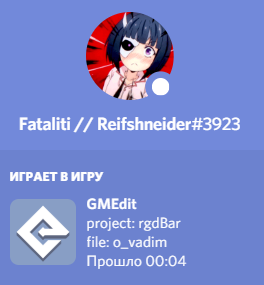

# GMEdit-Discord-RPC
A plugin for GMEdit which display your status in discord

***INSTALLING***
1. Download it
2. Place the plugin to %appdata%/AceGM/GMEdit/plugins/ on Windows, /Users/<username>/Library/Application Support/AceGM/GMEdit/plugins on macOS
3. Turn on `Game activity` in Discord 

***EXAMPLE***  

